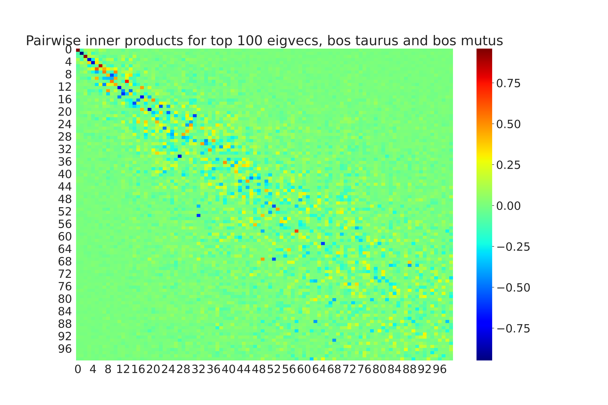

# Biological Networks for Alternative Proteins

This project is an ongoing investigation into the use of biological network modeling and transfer learning for alternative proteins development. In particular we leverage information about cell lines that are better-studied to make statistically sound inferences about less well-studied cell lines. 

## Protein-Protein Interaction Networks

Protein-protein interaction (PPI) networks are crucial tools for understanding the interaction of a cell line with candidate growth factors and recombinant proteins in a culture. We compare the PPI networks of homo sapiens with ruminant cell lines such as bos taurus and bos mutus. 

*Caption*: In the figure, we show an example comparing 300 nodes in the protein interaction networks of both *Homo sapiens* and *Bos taurus*. 

## Graph Transfer Learning Algorithms

Graph transfer learning algorithms leverage information about protein interaction networks for better-studied cell lines (such as *Homo sapiens* or CHO) to infer interactions for the true cell line of interest. 

In technical terms, we need a metric (or multiple metrics) on the space of PPI networks to measure alignment across different cell lines. For example, prior works have used phylogenetic tree distance as a starting point for the transfer learner. One can use phylogenetic information to parametrize a Bayesian prior for the distribution shift between the proteomes of different species.

## Eigenvector Alignment 

The spectral clustering of a biological network concentrates heavily on the top few eigenvectors of its adjacency matrix. If we compare the pairwise inner products of two closely-related cell lines (bos taurus and bos mutus), we can see that the values are close to 1 near the top, indicating that the clusterings of the two should be similar. 

*Caption*: In the figure, we show an example comparing top 100 eigenvectors of *Bos mutus* and *Bos taurus*. Inner product of 1.0 indicates maximal alignment, while -1.0 indicates maximal disalignment. We can think of the scores as roughly measuring correlations between clusters in the network. 

